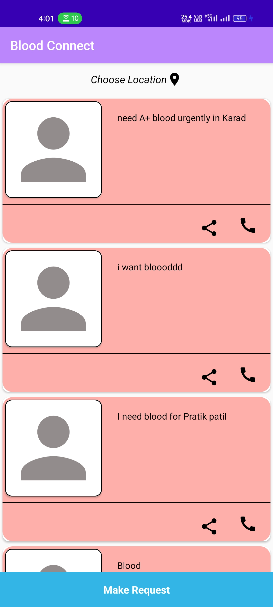
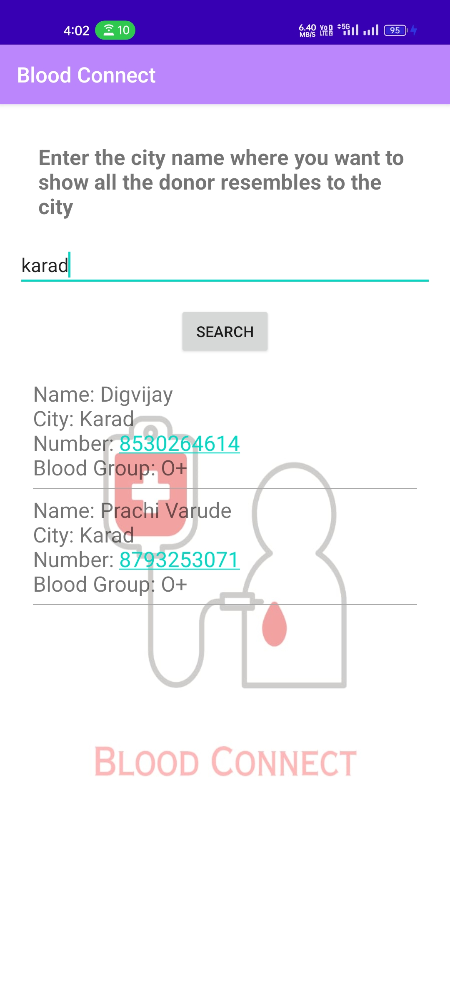
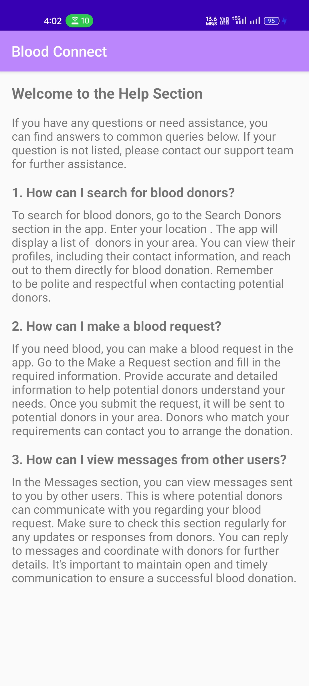

# blood-connect-application

## Description
Blood Bank Application in android, in this project I have tried to show most commonly used application development patterns and best practices.
The basic idea of app is to be able to share your request for urgent blood in the community of your city, and other major function of the app is to be able to find donors in your city with specific blood group.

## Working
I created a simple PHP web server using a free hosting provider: http://000webhost.com
There we have our MySQL database and some PHP scripts that are our APIs.
For android the languages we are using are Java and XML.

## Tool
#### Android Studio

## ScreenShots
Login Page                 |  Registration Page
:-------------------------:|:-------------------------:
  |  

Dashboard Pag              |  Help to others  Page
:-------------------------:|:-------------------------:
[) ](https://github.com/pratik208/blood-connect-application/blob/7547582880e08f2d36bfc13d7834b5634a04621a/Screenshot/login.jpg) |  

Search Page                |  Search Results Page
:-------------------------:|:-------------------------:
  |  

